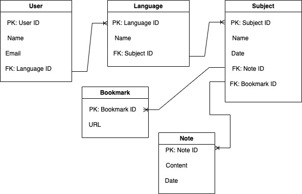
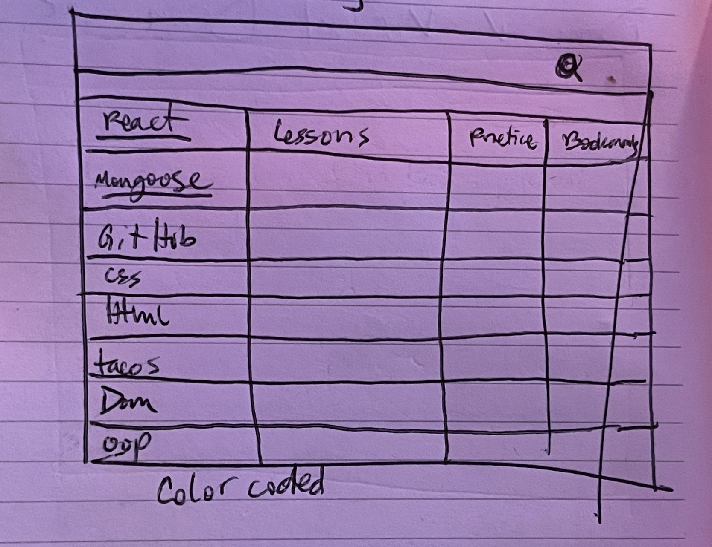
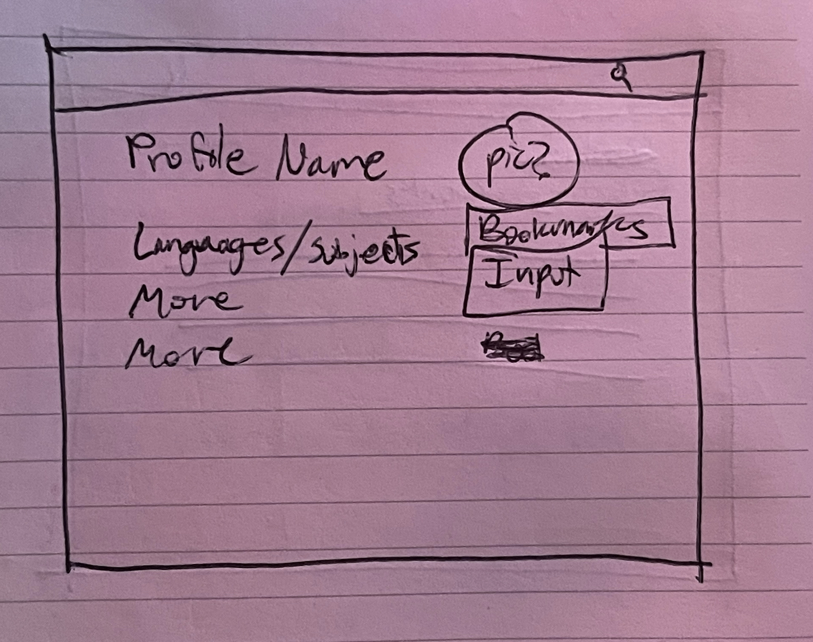
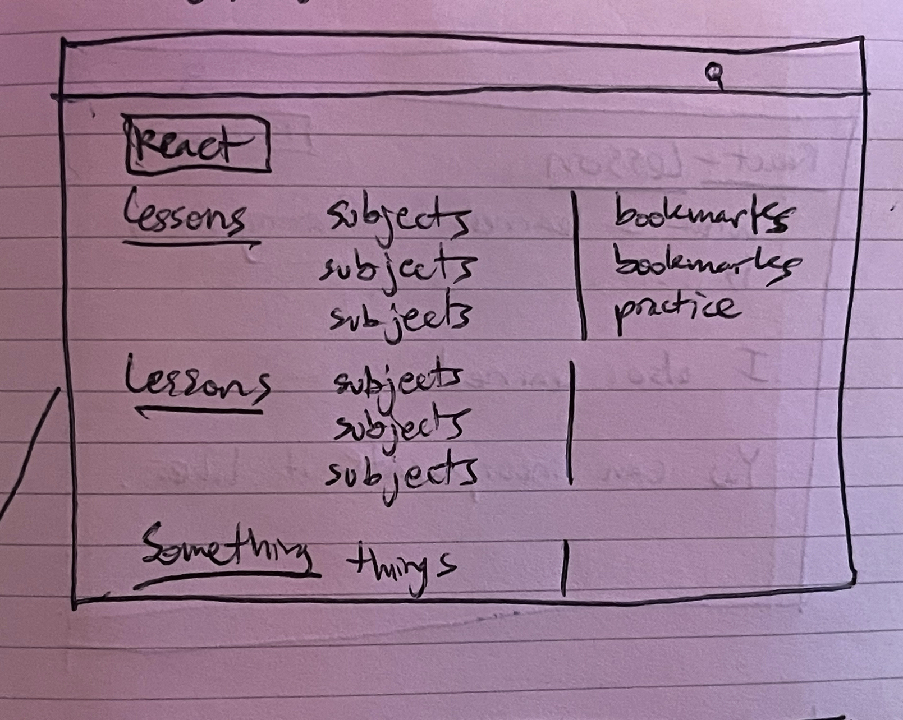
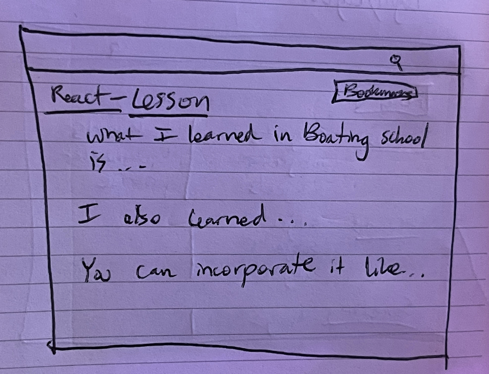
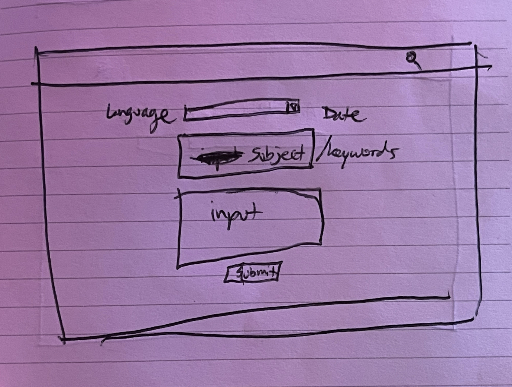
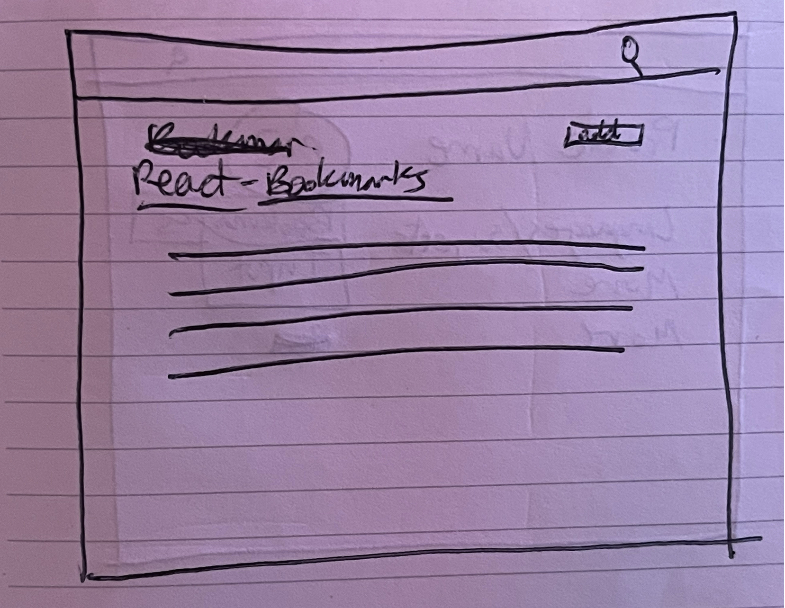

# **_UNTITLED ORGANIZATION APP_**

## 7/6/23

### Cody Garcia

### [Trello Board]()

_-_-\*

### **_Description_**

**A full-stack React app helping to organize for those learning the complexities and extremities of coding.**

_-_-\*

### **_Technologies_**

-React
-Vite
-Mongoose
-JavaScript
-HTML
-CSS

_-_-\*

### **_About the App_**

#### [THIS APP] is a React web application designed to provide structure to the ever-changing, ever-improving coding languages. It started as an idea to get all the lessons, VSCodes, bookmarks, assignments, projects, subjects, etc. all in one convenient location; saving tabs and tabs and open windows and open windows. Speed up your computer by minimizing the applications open, and inputing what you've learned, are learning, or would like to learn in this easily navigatable app. Log in to save your specific languages, lessons and subjects to review.

### **_Specifications_**

-The home page invites users to sign-in or sign-up. The home page may also include a color-coded grid of resources found from a possible API of information about the languages/subjects.
-Once authenticated, users will be able to access their profile of saved subjects.
-The users profile will have user information like name and avatar, a list of all languages they are working with, corresponding bookmarks, and a spot to input more.
-Each Language will have a section for subjects, notes and bookmarks.
-The Nav bar will have an input button, a search feature, and a login/logout button.
-The search feature will search through the users library, as well as an API on the subjects.

_-_-\*

### **_Entity Relationship Diagram_**

#### 

_-_-\*

### **_Wireframes_**

#### 

#### Wireframe of Homepage

#### 

#### Wireframe of Profile

#### 

#### Wireframe of Language Page

#### 

#### Wireframe of Individual Subject in a certain Language

#### 

#### Wireframe of Data Input

#### 

#### Wireframe of Bookmark Page

### **_Screenshots_**

### **_Stretch Goals_**

-The API feature may be this.
-A section next to each language that gets updated on the latest news/changes made to the language, and leads to a more descriptive page about it.

_-_-\*

### **_Credits_**
